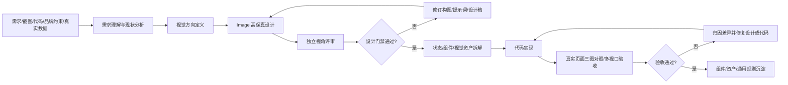
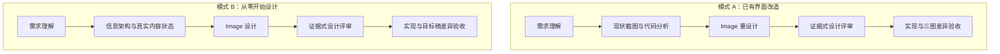
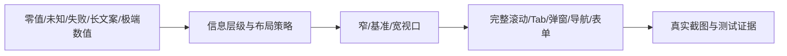

# Frontend Design Studio Skill 结构图（V1.3）

## 总体工作流

```mermaid
flowchart LR
  I["需求/截图/代码/品牌约束/真实数据"] --> U["需求理解与现状分析"]
  U --> D["视觉方向定义"]
  D --> G["Image 高保真设计"]
  G --> R["独立视角评审"]
  R --> J{"设计门禁通过?"}
  J -- "否" --> C["修订构图/提示词/设计稿"]
  C --> G
  J -- "是" --> A["状态/组件/视觉资产拆解"]
  A --> P["代码实现"]
  P --> Q["真实页面三图对照/多视口验收"]
  Q --> K{"验收通过?"}
  K -- "否" --> F["归因差异并修复设计或代码"]
  F --> P
  K -- "是" --> S["组件/资产/通用规则沉淀"]
```

## 两种工作模式

```mermaid
flowchart TB
  subgraph OLD["模式 A：已有界面改造"]
    A1["需求理解"] --> A2["现状截图与代码分析"] --> A3["Image 重设计"] --> A4["证据式设计评审"] --> A5["实现与三图差异验收"]
  end
  subgraph NEW["模式 B：从零开始设计"]
    B1["需求理解"] --> B2["信息架构与真实内容状态"] --> B3["Image 设计"] --> B4["证据式设计评审"] --> B5["实现与目标稿差异验收"]
  end
```

## 多视口与真实内容验证

```mermaid
flowchart LR
  S["零值/未知/失败/长文案/极端数值"] --> L["信息层级与布局策略"]
  L --> V["窄/基准/宽视口"]
  V --> T["完整滚动/Tab/弹窗/导航/表单"]
  T --> E["真实截图与测试证据"]
```

## 五层结构

页面层 → 组件层 → 页面模式层 → 视觉资产层 → Design Tokens。

**原则：** Image 生成不等于设计通过，代码构建通过不等于视觉验收通过；所有通过结论必须能被真实证据验证。
